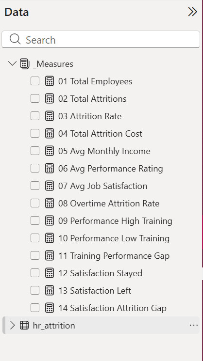
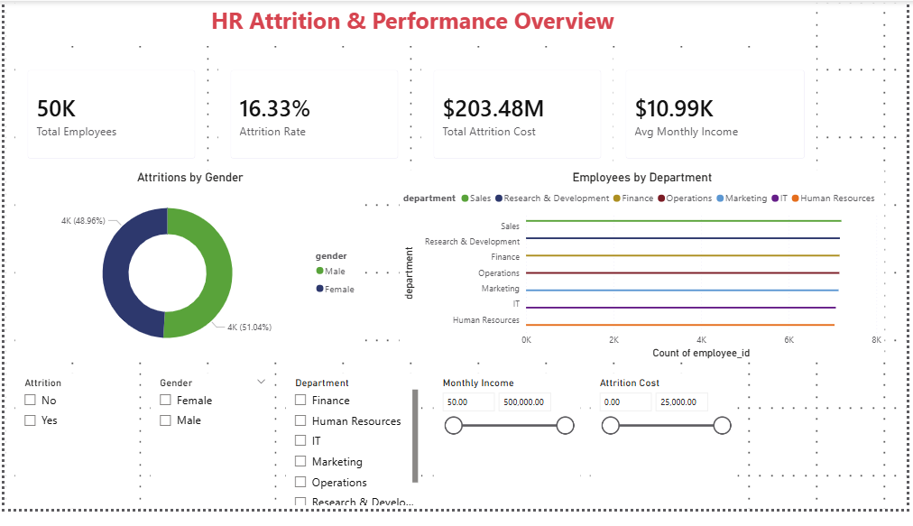
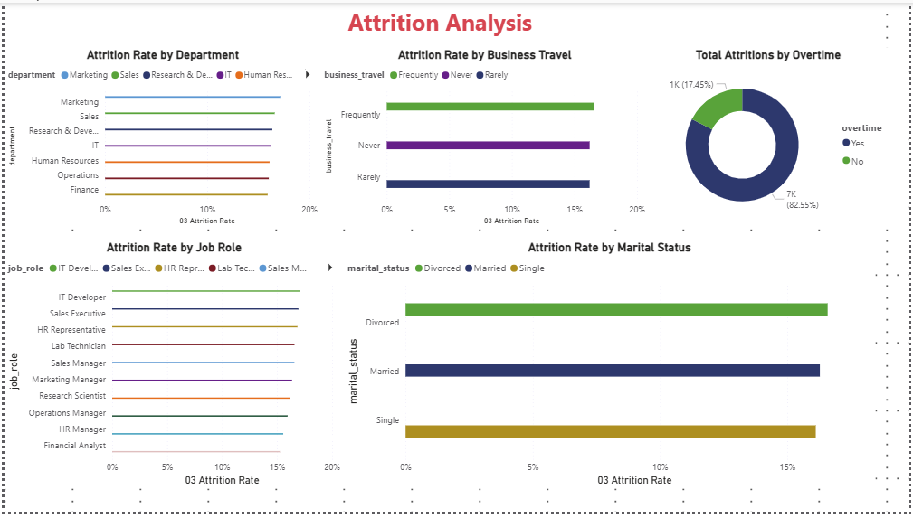
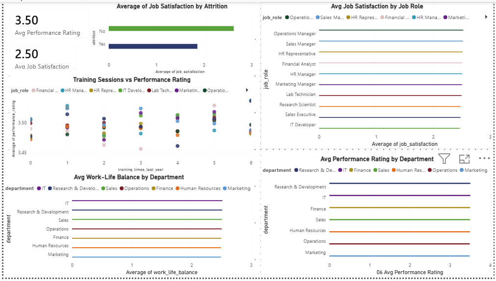
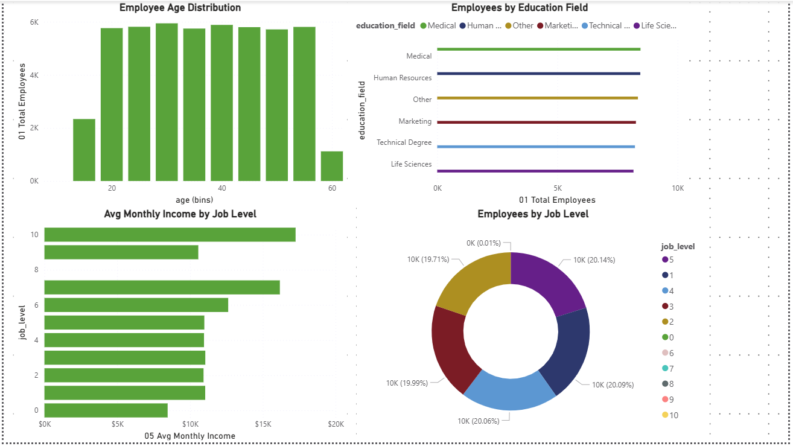

# HR Employee Attrition & Performance Analysis | Power BI


## Overview
This project analyses HR employee attrition and performance data for nearly 50,000 employees. The goal was to identify what actually drives attrition and underperformance — and to separate real signals from noise across department, role, demographics, training, and engagement.

---

## Business Questions
- What is the overall attrition rate, and does it vary by department or job role?
- Does overtime correlate with higher attrition?
- Does job satisfaction predict attrition?
- Does training frequency improve performance ratings?
- How does compensation vary across job levels?
- What does the overall workforce look like in terms of age, education, and seniority?

---

## Dataset
| Field | Description |
|---|---|
| `employee_id` | Unique employee identifier |
| `age` | Employee age |
| `department` | Department the employee belongs to |
| `job_role` | Employee's specific role |
| `gender` | Employee gender |
| `monthly_income` | Monthly salary |
| `job_level` | Seniority level (0–10 scale) |
| `years_at_company` | Total years with the company |
| `years_in_role` | Years in current role |
| `education_field` | Field of education |
| `business_travel` | Travel frequency |
| `marital_status` | Marital status |
| `work_life_balance` | Work-life balance score (1–4) |
| `job_satisfaction` | Job satisfaction score (1–4) |
| `performance_rating` | Performance rating (1–4) |
| `overtime` | Whether employee works overtime (Yes/No) |
| `num_companies_worked` | Number of previous companies |
| `training_times_last_year` | Number of training sessions attended |
| `attrition` | Whether employee left the company (Yes/No) |
| `attrition_cost` | Estimated cost of attrition per employee |

**Source:** HR Attrition Dirty Dataset

**Rows:** 50,020 raw → 49,931 cleaned &nbsp;·&nbsp; 

**Fields:** 20

---

## Data Cleaning (Power Query)

The raw dataset required several cleaning steps before analysis, including issues caught mid-analysis after charts surfaced abnormal values.

| Step | Transformation Applied |
|---|---|
| Removed empty rows | Deleted rows where all fields were blank |
| Removed leading and trailing whitespaces | Formatted all the cells in each column using TRIM |
| Removed invalid employee records | e.g 'employee_id' 12345
| Replaced values | Fixed embedded spaces e.g. `E M P00015` → `EMP00015` |
| Filtered invalid records | Removed rows with inconsistent or corrupt data |
| Validated employee_id | Kept only records with exactly 8 characters |
| Removed duplicates | Based on `employee_id` column |
| Replaced values | Based on 'attrition' column e.g 0=No, 1=Yes, Stayed=No, Left=Yes |
| Removed Outlier values | Based on 'Age' and 'monthly_income' columns e.g 0, 999 '-200', '-3000' | 
| Data type | Changed the columns to the correct data type |

- Identified and corrected inconsistent `business_travel` category values during analysis (discovered when attrition rates appeared abnormally high for one category — root cause was inconsistent text formatting)

**Original dataset:** 50,020 rows  
**Clean dataset:** 49,931 rows  
**Records removed:** 89  

---

## DAX Measures
All measures are stored in a dedicated `_Measures` table, numbered for consistent ordering in the Fields pane.

```dax
-- 01 Total Employees
01 Total Employees = COUNTROWS('HR_Attrition')

-- 02 Total Attritions
02 Total Attritions = 
COUNTROWS(FILTER('HR_Attrition', 'HR_Attrition'[attrition] = "Yes"))

-- 03 Attrition Rate
03 Attrition Rate = 
DIVIDE([02 Total Attritions], [01 Total Employees], 0)

-- 04 Total Attrition Cost
04 Total Attrition Cost = SUM('HR_Attrition'[attrition_cost])

-- 05 Avg Monthly Income
05 Avg Monthly Income = AVERAGE('HR_Attrition'[monthly_income])

-- 06 Avg Performance Rating
06 Avg Performance Rating = AVERAGE('HR_Attrition'[performance_rating])

-- 07 Avg Job Satisfaction
07 Avg Job Satisfaction = AVERAGE('HR_Attrition'[job_satisfaction])

-- 08 Overtime Attrition Rate
08 Overtime Attrition Rate = 
CALCULATE([03 Attrition Rate], 'HR_Attrition'[overtime] = "Yes")

-- 09 Performance: High Training (4+ sessions)
09 Performance High Training = 
CALCULATE(
    AVERAGE('HR_Attrition'[performance_rating]),
    'HR_Attrition'[training_times_last_year] >= 4
)

-- 10 Performance: Low Training (1 or fewer sessions)
10 Performance Low Training = 
CALCULATE(
    AVERAGE('HR_Attrition'[performance_rating]),
    'HR_Attrition'[training_times_last_year] <= 1
)

-- 11 Training Performance Gap
11 Training Performance Gap = 
[09 Performance High Training] - [10 Performance Low Training]

-- 12 Job Satisfaction: Stayed
12 Satisfaction Stayed = 
CALCULATE(AVERAGE('HR_Attrition'[job_satisfaction]), 'HR_Attrition'[attrition] = "No")

-- 13 Job Satisfaction: Left
13 Satisfaction Left = 
CALCULATE(AVERAGE('HR_Attrition'[job_satisfaction]), 'HR_Attrition'[attrition] = "Yes")

-- 14 Satisfaction Attrition Gap
14 Satisfaction Attrition Gap = 
[12 Satisfaction Stayed] - [13 Satisfaction Left]
```

All measures are stored in a dedicated `_Measures` table and numbered for easy navigation in the Fields pane:
.

---

## Dashboard Pages

| Page | Description |
|---|---|
| **Overview** | Company-wide KPIs — total employees, attrition rate, attrition cost, avg income, employee gender split, workforce by department |
| **Attrition Analysis** | Attrition rate broken down by department, job role, business travel, marital status, and overtime |
| **Performance & Satisfaction** | Performance ratings, job satisfaction, work-life balance, training impact, and satisfaction vs attrition |
| **Workforce Profile** | Age distribution, income by job level, education field breakdown, job level distribution |

---

## Dashboard Preview


**Perfrmance & Satisfaction** 

**Workforce Profile**


---

## Key Findings

**Attrition**
- Overall attrition rate is **16.33%**, with a total estimated attrition cost of **$203.48M**.
- Attrition is **consistent across department, job role, business travel, and marital status** (roughly 14–17% in every category) — attrition is not isolated to any specific team or group.
- **Overtime is the strongest driver of attrition**: 82.55% of all employees who left were working overtime, compared to just 17.45% who weren't.

**Performance & Satisfaction**
- Average performance rating (3.50/4) and average job satisfaction (2.50/4) are uniform across departments and job roles — no standout high or low performing group.
- **Training frequency has no measurable effect on performance** — employees with 4+ training sessions scored the same on average as those with 1 or fewer (0.00 difference).
- **Job satisfaction strongly predicts attrition**: employees who stayed had an average satisfaction score 0.76 points higher (on a 4-point scale) than those who left.

**Workforce Profile**
- Age distribution is roughly bell-shaped, peaking between 25–55 years old, with fewer employees under 20 or over 60.
- Average monthly income generally rises with job level (0–10 scale).
- Employees are spread fairly evenly across education fields, with no single field dominating the workforce.

**Note on Job Level 8:** This level contains only 1 employee in the dataset (age 56, 33 years at the company), making its average income statistically unreliable — a sample size of 1 cannot represent a meaningful average. This data point was excluded from the income-by-job-level chart to avoid a misleading visual, but the underlying employee record was retained in the dataset.

---

## Recommendations
- **Investigate overtime policy and workload distribution** — since overtime is the single strongest predictor of attrition, reducing excessive overtime (or compensating it better) is likely the highest-leverage retention lever available.
- **Treat retention as a company-wide initiative, not a department-specific one** — since attrition is broad-based rather than concentrated in any team or role.
- **Prioritise employee engagement and satisfaction programs over training investment** — training showed no measurable link to performance, while satisfaction showed a strong link to attrition.

---

## Tools Used
- **Power BI Desktop** — data modelling, DAX, multi-page dashboard
- **Power Query** — data cleaning and transformation, including mid-analysis corrections
- **CSV** — raw data source (50,020 rows)
